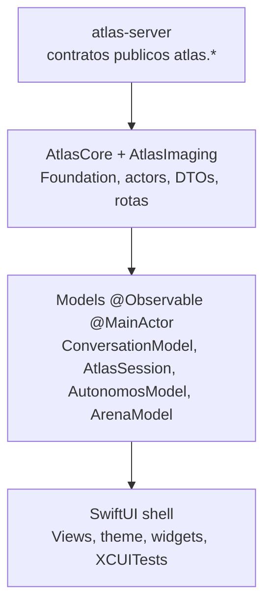

# Arquitetura do atlas-native

Mapa curto da casca iOS. A regra-mãe continua OBRA.md: a inteligencia mora no
atlas-server; o app renderiza contratos versionados e prova o que mostra.

## 1. Tres camadas

| Camada | Responsabilidade | Nao faz |
|---|---|---|
| `Sources/AtlasCore` | `AtlasClient`, `AtlasRoute`, DTOs, SSE, upload, outbox, checks de contrato | UI, copy editorial, UIKit |
| `App/Atlas/*Model*` + `AtlasSession` | seam observavel; transforma contratos em estado de tela | endpoint direto na View |
| `App/Atlas/*View*` + Widgets | projeção visual e interacao do operador | rede, JSON cru, storage, dado inventado |

## 2. Seams oficiais

- **Seam UI/Core:** models `@Observable @MainActor` expõem tipos publicos do
  Core (`ChatBubble`, `LocalDraft`, `UploadProgress`, `ExecAgent`,
  `AtlasComputeEffort`, `Workspace`, `TraceID`, `ThreadID`).
- **Seam rich input:** `AttachmentByteSource` entrega bytes por offset;
  `UploadTransport` espelha os tres endpoints chunked. O engine unico e o
  actor `AtlasRichInputEngine`.
- **Seam stream:** `InteractionRun` e `AtlasAiStreamSource` escondem create,
  SSE, polling, reconnect e cancelamento.

## 3. Contratos `atlas.*` consumidos

Tabela dos contratos principais vistos em `AtlasRoute`, DTOs do Core e
AtlasCoreChecks. Nao e inventario exaustivo: contrato novo precisa de DTO/check.

| Dominio | Rotas em `AtlasRoute` | Schemas principais |
|---|---|---|
| Conversa/execucao | `/ai/threads`, `/ai/interactions`, `/ai/jobs` | `atlas.execution.presentation.v1`, `atlas.ai.interaction_steer.v1`, `atlas.ai.surface_handoff.v1`, `atlas.long_message.v1` |
| Rich input/upload | `/ai/uploads/chunks/start`, `/chunk`, `/complete`; create em `/ai/interactions` | `atlas.rich_input.payload.v1` |
| Revisao/prova | `/ai/interactions/{trace}/change-review`, `/artifacts`, `/content` | `atlas.trace_change_review.v1`, `atlas.trace_artifacts.v1` |
| Atlas Codigo | `/code/graph`, `/code/provenance`, `/code/violations`, `/code/heals`, `/code/repos`, `/code/ask`, `/code/mirror`, `/code/week`, `/code/why` | `atlas.code.graph.v1`, `atlas.code.provenance.v2`, `atlas.code.violations.v1`, `atlas.code.heals.v1`, `atlas.code.repos.v2`, `atlas.code.ask.v1`, `atlas.code.mirror.v1`, `atlas.code.week.v1`, `atlas.code.why.v1` |
| Autonomos 24/7 | `/ai/software-company-stewardship/loop/*`, `/agents/status`, `/agents/history`, `/agents/task-health` | `atlas.software_company_stewardship.loop_command_*.v1`, `atlas.autonomos.cockpit_summary.v1`, `atlas.software_company_stewardship.ap790_loop_handoff.v1`, `atlas.software_company_stewardship.area_focus_operator_decision_receipt.v1`, `atlas.software_company_stewardship.loop_cycle_revert.v1`, `atlas.autonomos.digest.v1`, `atlas.agents.status.v1`, `atlas.agents.history.v1`, `atlas.autonomos.task_health.v1` |
| Arena | `/arena/composite`, `/arena/scoreboard`, `/arena/capabilities`, `/arena/runs/live`, `/arena/runs` | `atlas.arena.composite.v1`, `atlas.arena.scoreboard.v1`, `atlas.arena.capabilities.v1`, `atlas.arena.runs_live.v1`, `atlas.arena.start_receipt.v1` |

## 4. Execucao assíncrona e atores

- `AtlasClient`, `InteractionRun`, `AtlasRichInputEngine`, `InteractionOutbox`,
  `ThreadReadCache`, `QueuedFollowUpStore` e `AtlasDayRhythm` sao actors.
- Models ficam no `MainActor`; chamadas de rede saem para actors do Core e so a
  mutacao observavel volta para a main thread.
- SSE usa cursor monotônico, deduplicacao por sequencia e termina somente com
  `done`; reconexao esgotada e recuperavel, nao sucesso falso.

## 5. Fail-closed

`KeyedDecodingContainer.requireSchema` derruba o decode quando o schema nao e o
esperado. A tela deve mostrar ausencia/erro explicito; nunca converter payload
desconhecido em card, botao ou numero.

## 6. Boundary check

`swift run AtlasCoreChecks` inclui boundary checks da casca. O principal para
rich input: nenhum arquivo em `App/` pode falar com `/ai/uploads`; upload passa
somente pelo engine/Core. A mesma lei vale para todo endpoint: View fala com
model, model fala com Core, Core fala com o servidor.

## Canto canonico

Volte pelo indice `canto-canonico.md`. Docs irmaos:
`atlas-native-rich-input.md`, `atlas-native-codigo.md`,
`atlas-native-autonomos.md`, `atlas-native-gates.md`.
