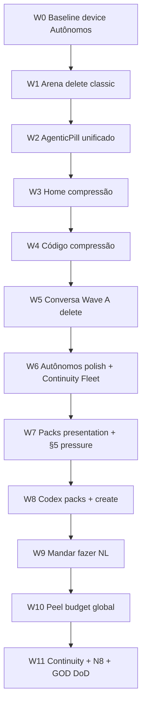

# Atlas Native — Plano GOD (compressão soberana · era agêntica)

> **For agentic workers:** REQUIRED SUB-SKILL: Use `superpowers:subagent-driven-development` (recommended) or `superpowers:executing-plans` to implement this plan wave-by-wave. Steps use checkbox (`- [ ]`) syntax for tracking.
>
> **Companion contracts:** `docs/prompts/grok-atlas-native-full-refactor.md` · `docs/engineering-knowledge-base/atlas-native-agentic-pill.md` · `OBRA.md` · Onda 1 Autônomos já entregue (`0e775045`).

**Goal:** Levar o `atlas-native` à **versão absoluta** do que já existe — Swift puro, mínimo de linhas, máximo de inteligência, fluidez, confiabilidade e manutenção — com a **pílula agêntica** como único verbo de intenção em toda superfície operacional.

**Architecture:** Casca SwiftUI fala só com models `@Observable`; Core/transporte/SSE ficam com Codex. Compressão = **deletar > fundir peels > abstrair**. Uma vertical por onda. Pílula = chrome único + pack compilado por ocasião (nunca misturar mundos).

**Tech Stack:** SwiftUI · Foundation · ImageIO · CryptoKit · AtlasTheme/Type/Motion · Fraunces · Liquid Glass · zero SPM novo sem OBRA §6.

## Global Constraints

- Branch: **`main` local apenas** — zero merge de obra.
- Gates por onda: `swift run AtlasCoreChecks` · `cd App && make build` · mudança visual → `make device`.
- Casca **nunca**: `Sources/**`, `ConversationModel.swift`, `AtlasSession.swift`, Makefile/project.yml, rede, JSON, UserDefaults.
- Vocabulário Criação: sem “Jarvis”; medição = **Arena** (não framing de rivalidade no código).
- Peel budget GOD: **proibir** arquivo novo <15 linhas sem justificativa; meta view ≤200 / arquivo ≤120 após recompressão; **delete > abstract**.
- Ciclo: Inventariar → Comprimir → Aprofundar → Comprimir.
- Pílula = **baseline**, não fase 2.
- Humano = Intenção · Julgamento · Assinatura · Veto. Agente = execução + qualidade.

---

## 0. Tese de produto (por que este plano existe)

Na era agêntica o operador **não** programa, não revisa linha a linha e não opera dashboards densos. O operador **direciona**.

Por isso existe a **pílula em toda tela**:

| Superfície | O que o humano pode fazer pela pílula (meta GOD) |
|---|---|
| **Home** | Perguntar o estado do Atlas; mandar abrir obra / conversa com contexto |
| **Conversa** | Composer = verbo dentro do fio (sink de todas as pílulas) |
| **Código / Grafo** | “Qual commit introduziu X?” · âncora por swipe · mandar cura governada |
| **Arena** | “Qual a pior métrica com Atlas?” · mandar rodar/parar medição governada |
| **Autônomos** | “O que este Autônomo fez?” · mandar pausar/criar quando §5 existir |
| **Continuity** | Atenção real (Island/lock); deep-link ask quando E-A1 fechar |

**Um chrome. Convites diferentes. Packs diferentes. Mundos nunca misturados.**

Este plano **não** é rewrite do Core nem “app novo”. É a **versão GOD do Atlas Native que já temos**.

---

## 1. Estado atual (baseline 2026-07-20 · 6 auditorias paralelas)

| Domínio | Arquivos (aprox.) | LOC (aprox.) | Diagnóstico |
|---|---:|---:|---|
| `App/Atlas` total | **2 157** | — | ~91% peels 8–30 linhas; 27 arquivos >100 |
| Home + Root chrome | 175 | ~3 000 | 1 stack vivo; peel excessivo; pílula = CTA genérico |
| Conversa vertical | ~1 094* | ~18 300* | LIVE; 73% arquivos <20 LOC; composer ≠ pílula |
| Atlas Código | 379 | ~7 552 | LIVE; AskPill over-peeled; “desvios” vs “sem retorno” |
| Arena Premium | 26 | ~3 335 | LIVE |
| Arena classic morto | ~167 | ~3 010 | **maior delete restante** |
| Autônomos (pós-Onda 1) | 56 | ~1 956 | Face v9 OK; peels busy/header + órfãos nightly |
| Widgets / Continuity | 216 | ~3 475 | Over-peel; Fleet desacoplado da face v9 |

\*inclui adjacentes (PlanCard, Markdown, Timeline, Execution…).

### Onda 1 já feita

- Commit `0e775045`: −~7 500 linhas Autônomos mortas.
- Design: `docs/superpowers/specs/2026-07-20-onda1-autonomos-compressao-design.md`.
- Device-pending: tour lista→hub→evolução→pílula.

---

## 2. Matriz da pílula (lei do produto)

| Superfície | Presente? | Pack | Mandar fazer | Ação GOD |
|---|---|---|---|---|
| Home | Visual ✓ | Fraco (picker) | Fraco | `HomeAskContext` + pack; unificar chrome |
| Workspace | Visual parcial | Fraco | Fraco | Mesmo chrome da Home; `turnFacts` |
| Conversa | Composer (sink) | Forte quando seeded | Via send | Unificar surface glass; não virar 2ª pílula |
| Código | ✓ (peel forest) | Parcial | Limitado | Colapsar peels; `AgenticPillChrome`; §5 pack |
| Arena | ✓ (`ArenaPremiumAskPill`) | Presentation-only | CTAs, não NL | §5 pack Core; NL→run/stop |
| Autônomos | ✓ (reusa Arena pill) | Honesto / fraco | Bloqueado §5 | Pack Core + POST create |
| Continuity | Ausente (ok atenção) | Snapshot | — | Deep-link ask opcional no fim |

**Lei visual:** um único tipo = craft Home (`atlasGlassCapsule` + ✦ vivo + itálico + fio ouro). Code/Workspace hoje **violam**.

---

## 3. Princípios de arquitetura GOD (Swift)

1. Composition > herança > abstração especulativa.
2. **Delete > fundir > abstrair** — protocol novo só com 2º consumidor.
3. Casca → model → Core. Zero endpoint na view.
4. Honestidade: ausência dita; zero número inventado; ouro só atenção real.
5. Peel budget: fundir micro-peels; split só quando >200 (view).
6. Performance: nav instantânea; lazy; zero await na cara; N8 medido no device.
7. A11y: `A11yID.*`; labels compostos; Reduce Motion + Dynamic Type.
8. Conversa = sink de intenção; superfícies = origem com pack.
9. Dual-stack = crime: uma implementação por superfície.
10. Prova ou não aconteceu: checks + build + device + OBRA §7.

---

## 4. Programa multi-semana (ondas)



| Onda | Duração | Dono | Meta LOC/arquivos | Gate |
|---|---|---|---|---|
| **W0** | 0.5 dia | Fable | 0 (prova) | `make device` Autônomos |
| **W1** | 2–3 dias | Fable | **−~3 000 LOC / −~167 files** Arena morto | checks+build+Arena XCUITest |
| **W2** | 2–3 dias | Fable | −~250 LOC; 1 chrome | device Home/Code/Arena/Autônomos |
| **W3** | 4–5 dias | Fable | Home 175→~50 files | LiveNow XCUITest |
| **W4** | 4–5 dias | Fable | Código −~27% files | grafo+pill device |
| **W5** | 3–4 dias | Fable | Conversa −~200 files (Wave A) | checks+build |
| **W6** | 3–4 dias | Fable | Autônomos −~25 files; Widgets Fleet −~20 | rhythm/nightly decision |
| **W7** | 1 semana | Fable | +contexts presentation | XCUITest pílula × superfície |
| **W8** | 1–2 semanas | **Codex** | contratos Core | live-probe |
| **W9** | 1 semana | Fable+Codex | NL→ações | device governado |
| **W10** | 2 semanas | Fable | −30% arquivos App/Atlas | 0 files >120 |
| **W11** | 1–2 semanas | Fable+Codex | Continuity + N8 | GOD DoD |

**Horizonte total:** ~6–10 semanas de obra disciplinado (não big-bang).

---

## 5. Onda a onda — tarefas rastreáveis

### W0 — Fechar Onda 1 Autônomos no device

- [ ] `cd App && make device`
- [ ] Tour: lista vazia → Novo → hub → Evolução → pílula → backs
- [ ] Screenshot operador + append OBRA §7 se device ok
- [ ] Se UITest rhythm/nightly falhar: registrar decisão (remount vs delete órfãos) para W6

---

### W1 — Arena: deletar dual-stack clássico (maior ROI)

**Escopo:** clusters mortos — `ArenaNowSection*`, `ArenaSuitesSection*`, `ArenaIndexSection*`, `ArenaEngineIndexRow*`, `ArenaEngineSheet*`, `ArenaCapabilitiesSection*`, `AtlasArenaView+Content/Loaded/Scroll/Header/Failure/States/A11y*` mortos.

**NÃO deletar ainda:** `ArenaRunSheet*`, `ArenaSuiteSheet*`, `ArenaCompositeChart*`, `ArenaDisplay`, `ArenaFormat`, Premium vivos.

- [ ] Inventário final `rg` de call sites (subagent explore) → lista DELETE
- [ ] Delete por família + `make build` incremental
- [ ] Remover `selectedEngine` / `suitesExpanded` mortos em `AtlasArenaView`
- [ ] Decidir Plan/Queue: **delete** `ArenaPremiumPlanQueueViews` + cases `.plan/.queue` **ou** wire em Execução
- [ ] `swift run AtlasCoreChecks` + `make build` + `AtlasArenaFlowTests`
- [ ] Commit `polish(ui): Arena delete classic dual-stack`
- [ ] OBRA §7

**Alvo:** ~−3 010 LOC.

---

### W2 — Um chrome de pílula (`AgenticPillChrome`)

- [ ] Extrair primitive compartilhado a partir de `ArenaPremiumAskPill` + Home
- [ ] Migrar Workspace (`WorkspaceView+ChromeNewPill*`) para o mesmo chrome
- [ ] Migrar Código (`AtlasCodeView+AskPill*` → 3 arquivos + chrome compartilhado)
- [ ] Manter convites/packs por superfície (`*AskContext`)
- [ ] Device: screenshot pílula Home / Workspace / Código / Arena / Autônomos
- [ ] Commit `polish(ui): AgenticPill chrome único`
- [ ] XCUITest: assert pílula por superfície (hoje só Arena)

---

### W3 — Home compressão

Sub-ondas:

#### W3.0 Hygiene
- [ ] Deletar stub `RootHomeSections+Conversation.swift`

#### W3.1 LiveNow fuse
- [ ] `LiveNow*` 55→~8 arquivos (manter `A11yID.liveNowSection`)
- [ ] Gate: `AtlasLiveNowTests`

#### W3.2 RootHome + RootChrome a11y fuse
- [ ] Fundir peels a11y Home/Chrome

#### W3.3 RootView chrome + lifecycle
- [ ] Colapsar `RootView+Chrome*` e `RootView+Lifecycle+*`
- [ ] **Perf:** defer `codeHub.refresh` e `arena.refreshSummary` para entrada da vertical (não todo Home open)

#### W3.4 Destinations + DeepLinks flatten
- [ ] 14 destinations → ~3; 10 deeplinks → ~2
- [ ] Smoke widget/`atlas://`

#### W3.5 HomeAskContext (presentation)
- [ ] Pack mínimo presentation-only até §5 Core
- [ ] Pill deixa de ser só workspace picker (ask sheet + pack; picker como fallback honesto)

**Alvo:** 175→~50 files.

---

### W4 — Código / Grafo compressão

#### W4.0 Honesty casca + delete dead
- [ ] Deletar `AtlasCodeSwipeToAsk.swift` (0 call sites)
- [ ] Radar A11y “desvios” → “sem retorno”
- [ ] Remover ou wire `.history` filter
- [ ] Pedidos §5 G1/G2 já em OBRA — pressionar Codex (não editar model)

#### W4.1 AskPill + Sheets collapse
- [ ] AskPill 14→3; Sheets 17→4
- [ ] Já alinhado a W2 chrome

#### W4.2 Graph hot path
- [ ] Flatten `GraphListRows+CommitRow+RowBuild+*`
- [ ] Spine Canvas: avaliar `drawingGroup()`; documentar N8
- [ ] Pedir Codex: memoizar `violatingHashes` (§5)

#### W4.3 Provenance + Why collapse
- [ ] Why 27→≤8; Provenance A11y forest ↓

#### W4.4 Radar + Hub
- [ ] Radar A11y collapse; HubModel on-demand

**Alvo:** ~379→~250 files / ~7.5k→~5.5k LOC.

---

### W5 — Conversa Wave A (delete & dedupe seguro)

**Não esperar U2/U3 para Wave A.**

- [ ] Deletar `ConversationComposer+CardBody+Grabber.swift` (EmptyView morto)
- [ ] Collapse `PageComposerArgs*` 8→1
- [ ] Collapse `ConversationSheets+Modifier*` forwarders
- [ ] Merge `ConversationMessages+Scroll*` peels
- [ ] Fold `ExecutionRibbon*` into Cockpit ribbon
- [ ] Relocate orphan `ComposerAttachmentsSheet+A11y*`
- [ ] Gates checks+build
- [ ] Commit `polish(ui): Conversation Wave A peel collapse`

**Waves B–D (depois, gated):**

| Wave | Gate | Conteúdo |
|---|---|---|
| B Composer/pill | U2 device | Unificar chrome; DraftStrip fuse |
| C Cockpit/proof | U3 + C15 | Cockpit/PlanCard/ChangeReview/Artifact fuse |
| D Markdown | — | AtlasMarkdownView collapse + IDs estáveis |

---

### W6 — Autônomos polish + Continuity Fleet

#### W6.A Autônomos
- [ ] Fundir `AutonomosViewHeader+*` → 2 arquivos
- [ ] Apagar ramo busy/failure se `phase` sempre `.loaded` (14 peels)
- [ ] Decisão **explícita** nightly/rhythm: remount no hub **ou** delete órfãos + fix UITests
- [ ] Podar A11yIDs mortos; renomear `AutonomosDigestToggleLine` → nome neutro (Arena usa)
- [ ] Vestment: um só (`HubVestment` vs Local)
- [ ] **Não** deletar `AutonomosModel+Control/Transfer/Decide` sem OK Codex (podem ser seam futuro) — marcar `ponytail:` ou mover pedido §5

#### W6.B Continuity
- [ ] Comprimir `AtlasWidgetAccessories+Fleet*` 34→~8
- [ ] Comprimir LiveSession timer + LockLive spoken peels
- [ ] Honesty: snapshot Fleet vs catálogo v9 (empty honesto ou background fetch mínimo via model — **sem** UserDefaults na casca)
- [ ] Manter `atlas://autonomos` golden

---

### W7 — Packs presentation + pressão §5

- [ ] `HomeAskContext`, enriquecer `ArenaPremiumAskContext` / `AutonomosAskContext` / Code facts (curados, não dump)
- [ ] Atualizar matriz em `atlas-native-agentic-pill.md` (Arena/Autônomos já têm pílula)
- [ ] XCUITest abertura pílula × superfície
- [ ] Lista §5 formal: packs Core + Autônomos POST + Grafo headline + Arena cases/engine

---

### W8 — Codex lane (contratos) — paralelo

Casca **espera**; não inventa.

- [ ] Pack Arena Core versionado
- [ ] Pack Autônomos + POST create + persistência
- [ ] Pack Home/Workspace/Código
- [ ] `runs/live.engine` sempre preenchido
- [ ] Lista de casos por run
- [ ] Grafo: `statusHeadline` + unidade “sem retorno”
- [ ] Live-probe onde wire mudar

---

### W9 — “Mandar fazer” (NL → ação governada)

Só depois dos packs/contratos mínimos.

- [ ] Arena: NL → enqueue / stop (reusa sheets governados)
- [ ] Autônomos: NL → pause/resume/create quando §5 existir
- [ ] Código: NL → heal/steer limitado ao contrato
- [ ] Zero botão falso; ausência = ausência

---

### W10 — Peel budget global (recompressão)

- [ ] Meta: App/Atlas **<1 500 arquivos**; **0 >120 linhas**
- [ ] Fundir A11y micro-peels (política: 1 arquivo A11y por feature)
- [ ] Fundir ConversationComposer / PlanCard / LiveTimeline / Markdown (Waves B–D)
- [ ] ArenaPremium split dos 4 arquivos >200 **depois** W1
- [ ] RunSheet 48→~8; SuiteSheet → Premium detail (opcional)

---

### W11 — Continuity + N8 + GOD DoD

- [ ] Arena Live Activity dedicada (M61/A10 — Codex+Fable)
- [ ] Deep-link ask `atlas://ask?surface=…` (se operador autorizar)
- [ ] Instruments N8: cold launch, hitches @120Hz, grafo 200, upload 20MB — baselines em `docs/evidence/`
- [ ] DEVICE_PROVEN U1–U6 / Arena E2E
- [ ] Checklist DoD §6 abaixo → OBRA §7 “GOD casca alcançada” ou lista honesta do que falta

---

## 6. Definition of Done — versão GOD

| Eixo | Critério |
|---|---|
| **Poder** | Pílula em Home/Workspace/Código/Arena/Autônomos; perguntar + mandar (onde contrato existe) |
| **Pack** | Pack compilado por superfície; absences explícitas; sem misturar mundos |
| **Pureza** | Boundary verde; 0 deps; 0 rede/JSON/storage na casca |
| **Compressão** | <1 500 arquivos App/Atlas; 0 >120 linhas; dual-stack Arena = 0 |
| **Beleza** | Um chrome de pílula; Fraunces/slate/gold; `.font(.system)` zerado em superfícies novas |
| **Velocidade** | N8 medido no device |
| **Honestidade** | Zero badge/número mentiroso; vazio/erro dignos |
| **Prova** | checks + build + device + XCUITest pílula + OBRA §7 |

---

## 7. Top 25 ações globais (ranking)

| # | Ação | ~Δ linhas | Risco | Onda |
|---|---|---:|---|---|
| 1 | Delete Arena classic morto | −3 010 | Baixo | W1 |
| 2 | Unificar AgenticPill chrome | −250 | Baixo | W2 |
| 3 | Home LiveNow fuse | −40 files | Médio | W3 |
| 4 | Código AskPill+Sheets collapse | −270 | Baixo | W4 |
| 5 | Conversa Wave A | −200 files | Baixo | W5 |
| 6 | Autônomos busy/header fuse | −500 | Baixo | W6 |
| 7 | Widgets Fleet peel | −300 | Médio | W6 |
| 8 | Radar/Code “sem retorno” honesty | copy | Baixo | W4 |
| 9 | Delete `AtlasCodeSwipeToAsk` | −42 | Nenhum | W4 |
| 10 | Home defer refreshes | perf | Baixo | W3 |
| 11 | Arena Plan/Queue orphan delete | −224 | Baixo | W1 |
| 12 | Recomprimir ArenaPremium >200 | split | Baixo | W10 |
| 13 | Pack Arena Core | contrato | Médio | W8 |
| 14 | Autônomos POST create | contrato | Alto | W8 |
| 15 | Pack Home/Code | contrato | Médio | W8 |
| 16 | NL Arena run/stop | +wiring | Médio | W9 |
| 17 | Grafo headline Core | contrato | Médio | W8 |
| 18 | Conversa Waves B–D | −grande | Médio | W10 |
| 19 | Markdown IDs estáveis | confiabilidade | Médio | W10 |
| 20 | ChangeReview fetch-on-scroll | bugfix | Médio | W5/W10 |
| 21 | Nightly/rhythm decisão | testes | Médio | W6 |
| 22 | Fleet widget honesty | Continuity | Médio | W6 |
| 23 | XCUITest pílula × superfície | prova | Baixo | W7 |
| 24 | N8 Instruments | prova | Ops | W11 |
| 25 | Peel budget policy OBRA | governança | Baixo | W10 |

---

## 8. Pedidos §5 (Codex) — bloqueiam GOD completo

Copiar/pressionar em `OBRA.md` §5 (já parcialmente listados):

1. Pack pílula Arena / Home / Código / Autônomos (contratos versionados).
2. POST criar Autônomo + persistência.
3. `runs/live.engine` sempre presente.
4. Lista de casos por `run_id_public`.
5. Grafo: headline + unidade “sem retorno”.
6. Plano multi-suíte `plan.v1` (só se operador ainda quiser).
7. Live Activity Arena; Continuidade deep-link ask.
8. Memoização `violatingHashes` / campos agent no grafo.

Casca **não contorna**.

---

## 9. Protocolo anti-erro (obrigatório em toda onda)

```text
Explore (subagent) → Design ≤1 página → OK operador se estrutural
  → Implement 1 vertical → check-work → Gates → Device → OBRA §7 → commit escopado
```

**Red flags (param merge):**
- Pílula ausente em superfície operacional
- Segunda família visual de pílula
- Pack misturando Arena↔Grafo↔Autônomos
- Número inventado / botão falso
- Arquivo novo <15 linhas sem justificativa
- `git add -A` / tocar Core “de passagem”
- DEVICE-PENDING >7 dias escondido

**Subagents sugeridos por onda:**
- 1× `explore` (call sites / dead)
- 1× `plan` (design da vertical)
- Após implement: review / check-work
- Opcional: Grok Builder `/design` + HANDOFF → Cursor implementa (como Onda 1)

---

## 10. O que este plano **não** é

- Rewrite do AtlasCore / SSE / models
- App RN 2.0 (inchaço “fundação”)
- Substituir providers (Atlas continua soberano; Grok/Claude/Codex = motores)
- “Benchmark theater” na casca
- Big-bang de 2 000 arquivos num commit

---

## 11. Ordem de execução imediata (próximas 72h)

1. [ ] **W0** — `make device` Autônomos (fechar Onda 1)
2. [ ] **W1** — Arena delete classic (maior compressão restante)
3. [ ] **W2** — AgenticPill chrome único
4. [ ] Começar **W3.1** LiveNow fuse em paralelo só se W1 verde

---

## 12. Fontes das auditorias (2026-07-20)

Consolidadas de 6 explores paralelos nesta sessão:
- Home / Root chrome
- Conversa / Workspace / Composer / Cockpit
- Atlas Código / Grafo
- Arena Premium vs classic
- Autônomos pós-Onda 1 + Continuity
- Cross-cutting: Theme, pílula, boundary, gates

Design Onda 1 Autônomos: `docs/superpowers/specs/2026-07-20-onda1-autonomos-compressao-design.md`  
Prompt mestre casca: `docs/prompts/grok-atlas-native-full-refactor.md`  
Bootstrap Grok Builder: `docs/prompts/grok-builder-max-power-bootstrap.md`

---

*Fim do plano GOD. Atualizar este arquivo ao fechar cada onda (checkboxes + evidência). Horizontes longos sem prova viram mentira — preferir ondas curtas verdes.*
